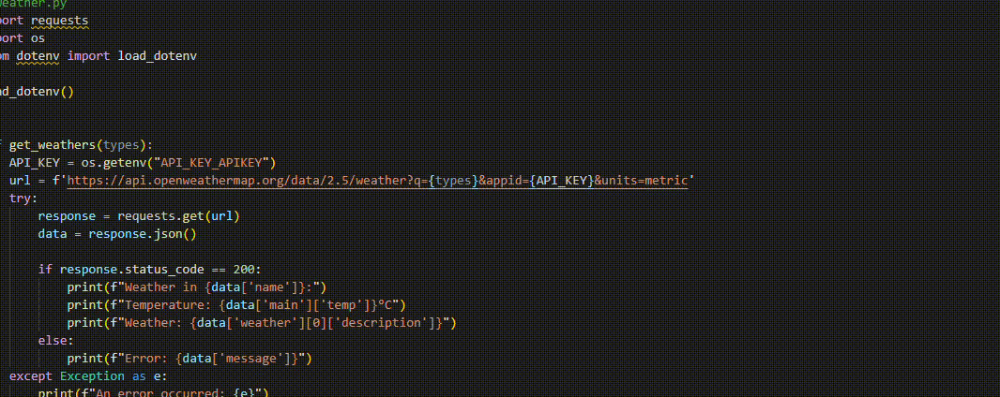

# API Guardian

API Guardian is a Visual Studio Code extension designed to scan your project for APIs. Once the APIs are identified, they will be tested, and a report will be generated containing the full API, its file location, status, and a corresponding message. Developers can also hover over the APIs found in their project a pop-up messaage will appear based on the status of your API. This extension currently works for JavaScript, TypeScript, Python, CSharp and PHP. This extension streamlines debugging and testing, reducing manual effort and allowing you to focus more on development.

## Features

This project is part of a learning experience, and while we continuously work to enhance its functionality, we cannot guarantee specific performance outcomes or results. We appreciate your understanding and support as we refine this extension.

As a limitation, the extension can scan GET, POST, UPDATE, and DELETE API endpoints in JavaScript, TypeScript, and Python. However, for C#, PHP, and Java, it currently supports scanning only GET API endpoints.


- Scan your project for APIs, below are examples of the type of API we are able to scan
    1. http://api.weatherapi.com/v1/forecast.json?key={apikey}&q={country}&days={number_of_days}
    2. https://eventregistry.org/api/v1/minuteStreamArticles?lang=eng&recentActivityArticlesUpdatesAfterMinsAgo=240&isDuplicateFilter=skipDuplicates&apiKey={api_key}
    
- An Excel report containing this information will be generated and exported to your project.
    1. Number of APIs found in your project
    2. Number of Successfully tested APIs in your project
    3. Number of Failed tested APIs in your project
    4. Full APIs
    5. File Location of where the API was found
    6. Status of the API
    7. Message of the API

- Hover message when the developer mouse over the API found in the project
    1. To view recommended fix for any error occured in your API Endpoint, follow the steps in this link to create an API Key. https://developers.google.com/custom-search/v1/overview
    2. After creating the key, follow the Instructions at "How use the extension" to save the key. 
<div style="text-align: center;">
    <p>Success Hover Message </p>
    
    <br>
    <p>Failed Hover Message with API Key</p>
    
    <br>
    <p>Failed Hover Message without API Key</p>
    
</div>

## Setup Instructions
After installing the extension, the necessary dependencies will be automatically installed. If you encounter any issues, run the following command in the extension's folder: <br>
*Keep in mind users will experience errors if they do not have the right environment installed (Node.js)*
```bash
npm install
```


## How to use the extension
1. Open your project in Visual Studio Code and ensure at least one code file is open. 
2. After opening your project, press **CTRL + SHIFT + P**
3. Type **Search For API**
<div style="text-align: center;">
    
</div>

4. Press **Enter** to run the command
5. When running the extension for the first time, paste the API key in the prompt. 
5. The extension will ask if you will like to Scan or Skip files or you can Update the API key, you can choose one of the option:
<div style="text-align: center;">
    
</div>

6. Specify which files to scan or skip:
    - **Scan/Skip All Files**: Simply press Enter to apply the action to all files.
    - **Scan/Skip a Single File**: Type the file name with its extension (e.g., main.py) and press Enter.
    - **Scan/Skip Multiple Files**: Use the format main.py | pythonFile.py (separate file names with |) and press Enter.

## Copyright

© 2024 Joy Cheng Yee Shing. All rights reserved.


This project is licensed under the [MIT License](LICENSE).

Permission is hereby granted, free of charge, to use, copy, modify, merge, publish, distribute, sublicense, and/or sell copies of the Software, and to permit persons to whom the Software is provided to do so, subject to the following conditions:

- The above copyright notice and this permission notice shall be included in all copies or substantial portions of the Software.
- The software is provided "as is", without warranty of any kind, express or implied, including but not limited to the warranties of merchantability, fitness for a particular purpose, and noninfringement. In no event shall the authors or copyright holders be liable for any claim, damages, or other liability, whether in an action of contract, tort, or otherwise, arising from, out of, or in connection with the software or the use or other dealings in the software.

If you have any questions or feedback, feel free to reach out to joyyyy.cheng@gmail.com.

## Developer Information

- **Developer**: Joy Cheng Yee Shing
- **Email**: joyyyy.cheng@gmail.com
- **GitHub**: [\[Github Profile\]](https://github.com/joyyycheng)


## Project and School Information

- **Project**: API Guardian - A Visual Studio Code Extension
- **School**: Singapore Institute of Technology and University of Glasgow
- **Instructor**: Dr Peter Yau
<br>
<div style="text-align: center;">
    
</div>


## Contact

For any questions or feedback, please reach out to joyyyy.cheng@gmail.com.
